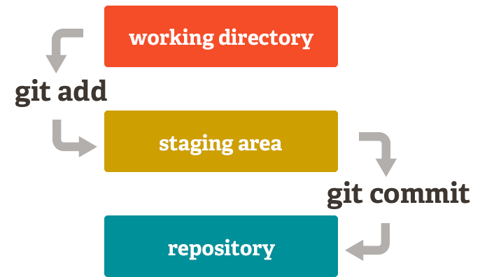

# MANUAL GIT

1. [Introducción a Git](#introducción-a-git)
2. [Creación y actualización de repositorios](#creación-y-actualización-de-repositorios)
3. [Historial de cambios](#historial-de-cambios)
4. [Deshacer cambios](#deshacer-cambios)
5. [Gestión de ramas](#gestión-de-ramas)
6. [Repositorios remotos](#repositorios-remotos)

## Introducción a Git
---
### ¿Qué es Git?
[Git](https://git-scm.com/) es un SCV (Sistema de Control de Versiones) de código abierto ideado por Linus Torvalds (padre del sistema operativo **Linux**) y actualmente es el sistema de control de versiones más extendido.

A diferencia de otros SCV, Git tiene una arquitectura *distribuida*, lo que significa que en lugar de guardar todos los cambios de un proyecto en un único sitio, cada usuario contiene una copia del repositorio con el historial de cambios completo del proyecto. Esto aumenta significativamente su rendimiento.

### Configuración de Git
Antes de empezar a usar Git es necesario configurarlo con el nombre de usuario y su correo electrónico.
~~~~ bash
git config --global user.name "Your-Full-Name"       # Establecer el nombre de usuario
git config --global user.email "your-email-address"  # Establecer el correo del usuario
git config --global color.ui auto                    # Activar el coloreado de la salida
git config --global merge.conflictstyle diff3        # Mostrar el estado original en los conflictos
git config --list                                    # Mostrar la configuración
~~~~

## Creación y actualización de repositorios
---
### Creación de un repositorio
~~~~ bash
git init <nombre-repositorio>                        # Crea un repositorio nuevo con el nombre <nombre-repositorio>
~~~~
Este comando crea una nueva carpeta con el nombre del repositorio, que a su vez contiene otra carpeta oculta llamada *.git* que contiene la base de datos donde se registran los cambios en el repositorio.

### Clonación de un repositorio
~~~~ bash
git clone <url-repositorio>  # Crea una copia local del repositorio ubicado en la dirección <url-repositorio>
~~~~
A partir de que se hace la copia, los dos repositorios, el original y la copia, son independientes, es decir, cualquier cambio en uno de ellos no se verá reflejado en el otro.

### Añadir cambios a un repositorio
Cualquier cambio que hagamos en un proyecto tiene que pasar por tres estados hasta que guarde definitivamente en el repositorio.
1. **Directorio de trabajo** : directorio que contiene una copia de una versión concreta del proyecto en la que se está trabajando. Puede contener ficheros que no pertenecen al repositorio.

~~~~ bash
git add <fichero>  # Añade los cambios en el fichero <fichero> del directorio de trabajo a la zona de intercambio temporal.
git add <carpeta>  # Añade los cambios en todos los ficheros de la carpeta <carpeta> del directorio de trabajo a la zona de intercambio temporal.
git add .          # Añade todos los cambios de todos los ficheros no guardados aún en la zona de intercambio temporal.
~~~~

2. **Zona temporal de intercambio (*staging area*)** : zona donde se guardan los cambios temporalmente desde el directorio de trabajo antes de hacerlos definitivos y registrarlos en el repositorio.

~~~~ bash
git commit -m "mensaje"          # Confirma todos los cambios de la zona de intercambio temporal añadiéndolos al repositorio y creando una nueva versión del proyecto. "mensaje" es un breve mensaje describiendo los cambios realizados que se asociará a la nueva versión del proyecto.
git commit --amend -m "mensaje"  # Cambia el mensaje del último commit por el nuevo mensaje "mensaje".
~~~~

3. **Repositorio** : donde finalmente se guardan los cambios confirmados desde la zona temporal de intercambio.

### Registro de cambios
Para guardar los cambios en un repositorio Git utiliza una estructura de tres niveles:

- **Commit** : Contiene información sobre el autor, el momento y el mensaje de los cambios.
- **Árbol (*tree*)** : Cada *commit* contiene además un árbol donde se registran los nombres y rutas de los ficheros en el repositorio cuando se hizo el *commit*.
- **Blob (*binary file object*)** : Para cada uno de los ficheros listados en el árbol hay un *blob*, que contiene una instantánea comprimida del contenido del fichero cuando se hizo el *commit*.

> ℹ️ Si un fichero del repositorio no ha cambiado en el commit, el árbol apunta al blob del fichero del último commit donde el fichero cambió.

### Referenciar a un commit
Cada *commit* tiene asociado un código *hash* de 40 caracteres hexadecimales que lo identifica de manera única. Hay dos formas de referirse a un *commit*:
- **Nombre absoluto** : Se utiliza su código *hash* (basta indicar los 4 o 5 primeros dígitos).
- **Nombre relativo** : Se utiliza la palabra *HEAD* para referirse siempre al último *commit*. Para referirse al penúltimo *commit* se utiliza *HEAD~1*, al antepenúltimo *HEAD~2*, etc.

## Historial de cambios
---
### Mostrar el estado de un repositorio
~~~~ bash
git status  # Muestra el estado de los cambios en el repositorio desde la última versión guardada.
~~~~
> ❗ En particular, muestra los ficheros con cambios en el directorio de trabajo que no se han añadido a la zona de intercambio temporal y los ficheros en la zona de intercambio temporal que no se han añadido al repositorio.

### Mostrar el historial de versiones de un repositorio
~~~~ bash
git log            # Muestra el historial de commits (hash, autor, fecha, hora y mensaje asociado) de un repositorio ordenado cronológicamente.
git log --oneline  # Muestra cada commit en una línea produciendo una salida más compacta.
git log --graph    # Muestra la historia en forma de grafo.
~~~~

### Mostrar los datos de un commit
~~~~ bash
git show           # Muestra el usuario, día, hora y mensaje del último commit, así como las diferencias con el anterior.
git show <commit>  # Muestra el usuario, día, hora y mensaje del commit indicado, así como las diferencias con el anterior.
~~~~

### Mostrar el historial de cambios de un fichero
~~~~ bash
git annotate  # Muestra el contenido de un fichero anotando cada línea con información del commit en el que se introdujo.
~~~~
> ℹ️ Cada línea de la salida contiene los 8 primeros dígitos del código *hash* del *commit* correspondiente al cambio, el autor de los cambios, la fecha, el número de línea del fichero y el contenido de la línea.

### Mostrar las diferencias entre versiones
~~~~ bash
git diff           # Muestra las diferencias entre el directorio de trabajo y la zona de intercambio temporal.
git diff --cached  # Muestra las diferencias entre la zona de intercambio temporal y el último commit.
git diff HEAD      # Muestra la diferencia entre el directorio de trabajo y el último commit.
~~~~

## Deshacer cambios
---

## Gestión de ramas
---

## Repositorios remotos
---
