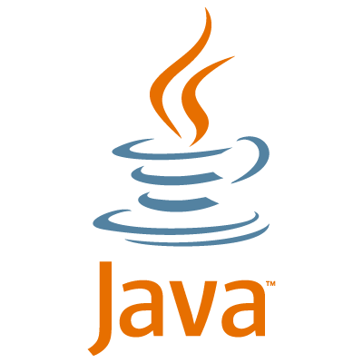

# MANUAL JAVA

1. [INTRODUCCIÓN A JAVA](#introducción-a-java)
   - [Tecnologías Java](#tecnologías-java)
   - [Instalar Java](#instalar-java)
3. [CONCEPTOS BÁSICOS](#conceptos-básicos)
4. [OPERADORES](#operadores)
5. [SENTENCIAS DE CONTROL](#sentencias-de-control)
6. [CLASE STRING](#clase-string)
7. [ARRAYS](#arrays)
8. [APPLETS](#applets)

## INTRODUCCIÓN A JAVA
**Java** es un lenguaje de programación de propósito general, tipado, orientado a objetos,
- desarrollo de aplicaciones (básicas, empresariales, móviles, ...)

**Java** nacía como un lenguaje de programación que pudiese ser multiplataforma y multidispositivo, bajo el paradigma *Write Once Run Anywhere* (WORA)

De esta forma un programa **Java** escrito una vez podemos ejecutarle sobre diferentes plataformas, siendo soportados los sistemas operativos *Windows*, *MacOs* y *UNIX*. Y a su vez en diferentes tipos de dispositivos.

Para poder seguir este paradigma la compilación de un programa **Java** no genera código fuente, si no que genera *bytecodes*, interpretados por una máquina virtual o **JVM** (*Java Virtual Machine*). Dicha máquina ya está escrita para cada uno de los sistemas operativos en cuestión.

## CONCEPTOS BÁSICOS

## OPERADORES

## SENTENCIAS DE CONTROL

## CLASE STRING

## ARRAYS

## APPLETS
