# MANUAL LaTeX

1. **[INTRODUCCIÓN](#1-introducción)**
    1. [¿Qué es *TeX*?](#11-qué-es-tex)
    2. [¿Qué es *LaTeX*?](#12-qué-es-latex)
    3. [Instalación](#13-instalación)
    4. [Hola LaTeX](#14-hola-latex)
        1. [Compilación](#141-compilación)
2. **[ESTRUCTURA DE UN DOCUMENTO](#2-estructura-de-un-documento)**
    1. [Esqueleto básico para *pdflatex*](#21-esqueleto-básico-para-pdflatex)
        1. [Clase de un documento](#211-clase-de-un-documento)
        2. [Preámbulo](#212-preámbulo)
        3. [Cuerpo](#213-cuerpo)
    2. [Esqueleto básico para *xelatex*](#22-esqueleto-básico-para-xelatex)
3. **[SECCIONES Y PÁRRAFOS](#3-secciones-y-párrafos)**
    1. [Secciones y subsecciones](#31-secciones-y-subsecciones)
    2. [Párrafos y cambios de línea](#32-párrafos-y-cambios-de-línea)
    3. [Justificación](#33-justificación)
4. **[FORMATEO BÁSICO](#4-formateo-básico)**
    1. [Negrita, cursiva y subrayado](#41-negrita-cursiva-y-subrayado)
    2. [Familias de tipos de letra](#42-familias-de-tipos-de-letra)
    3. [Perfiles de letra](43-perfiles-de-letra)
    4. [Tamaños de letra](44-tamaños-de-letra)
5. **[LISTAS](#5-listas)**
6. **[TABLAS](#6-tablas)**
7. **[IMÁGENES](#7-imágenes)**
8. **[FÓRMULAS MATEMÁTICAS](#8-fórmulas-matemáticas)**
    1. Símbolos matemáticos
        1. Letras griegas
        2. Operadores aritméticos
        3. Relaciones
        4. Operadores binarios
        5. Lógica
        6. Conjuntos
        7. Flechas
        8. Puntos suspensivos
        9. Otros símbolos
        10. Funciones
    2. Subíndices y superíndices
    3. Fracciones
    4. Sumatorios, productorios e integrales
    5. Sombreros
    6. Matrices
    7. Teoremas
9. **[ENTORNOS FLOTANTES](#9-entornos-flotantes)**
    1. Entorno flotante para figuras
    2. Entorno flotante para tablas
10. **[REFERENCIAS CRUZADAS Y NOTAS A PIE](#referencias-cruzadas-y-notas-a-pie)**
    1. Referencias cruzadas
    2. Notas a pie de página
11. **[CITAS Y REFERENCIAS BIBLIOGRÁFICAS](#11-citas-y-referencias-bibliográficas)**
12. **[DISEÑO DE PÁGINA](#12-diseño-de-página)**
    1. Dimensiones y márgenes
    2. Encabezados y pies de página

## 1. INTRODUCCIÓN
---
### 1.1. ¿Qué es *TeX*?
*TeX* es un sistema de composición de documentos de alta calidad, orientado especialmente a la creación de documentos científicos y técnicos que incluyen fórmulas matemáticas. Fue creado por ***Donald Knuth*** en **1978**.

A diferencia de un procesador de textos como por ejemplo *Microsoft Word*, *TeX* no es una aplicación sino un lenguaje de programación que require compilar el código fuente para obtener el documento final. Esto, que a priori podría parecer una desventaja, en realidad es la gran ventaja de *TeX* frente a los procesadores de texto que siguen el paradigma WYSIWYG (What You See Is What You Get), ya que permite separar fácilmente el contenido y la estructura de un documento, de su formato, de manera que el usuario puede centrarse en el contenido y la estructura del documento, y dejar que *TeX* se encargue del formato. De hecho, *TeX* incorpora un potente lenguaje de marcado para estructurar y formatear el texto de un documento. Por ejemplo, mientras que para poner una palabra en negrita con un procesador de textos como *Microsoft Word*, bastaría con seleccionar la palabra y hacer clic en el botón de negrita para ver automáticamente la palabra en negrita en la pantalla del ordenador, en *TeX* habría que escribir en el fichero con el código fuente ***{\bf palabra}*** y después compilar el código fuente para obtener un documento final con la palabra en negrita (el comando ***\bf***, que permite aplicar la negrita, se conoce como marca o tag en inglés.) La página principal con información sobre *TeX* es la del [TeX Users Group](https://www.tug.org/).

### 1.2. ¿Qué es *LaTeX*?

*LaTeX* es un conjunto de macros para *TeX* debido originalmente a ***Leslie Lamport*** para facilitar el uso de *TeX*.

Tanto *TeX* como *LaTeX* son programas de código abierto, liberados bajo la licencia *LPPL*. Otra de las grandes ventajas de *LaTeX* es que existen multitud de paquetes de código libre
para generar distintos tipos de documentos que pueden descargarse desde el repositorio *[CTAN](https://ctan.org/)*.

La página principal sobre *LaTeX* es [The LaTeX project](https://www.latex-project.org/)

### 1.3. Instalación
Existen distintas distribuciones de *LaTeX* y algunas de ellas son multiplataforma, es decir, están disponibles para diferentes sistemas operativos. Las distribuciones más comunes son:
- *[TeXLive](https://www.tug.org/texlive/)* para *Windows*, *Mac OSX* y *Linux*.
- *[MiKTeX](https://miktex.org/)* para *Windows*, *Mac OSX* y *Linux*.
- *[MacTeX](https://www.tug.org/mactex/)* para *Mac OSX*.
> En sus respectivas páginas está explicado el procedimiento de instalación de cada una.

Junto a la distribución de *LaTeX* es también habitual instalar algún editor de texto para escribir el código fuente. En realidad puede usarse cualquier editor de texto que ya esté instalado en nuestro sistema operativo, pero los existen entornos de edición especializados que facilitan muchas de las tareas del proceso de composición de documentos con *LaTeX*. Los más comunes son:
- *[TeXmaker](https://www.xm1math.net/texmaker/)* - Es un editor de texto libre, multiplataforma, con muchos asistentes disponibles que permite previsualizar en tiempo real el documento final en *pdf*.
- *[TeXstudio](https://www.texstudio.org/)* - Es otro editor libre y multiplataforma que incorpora aún más asistentes que el anterior.
- *[Vim](https://www.vim.org/)* - Es un editor de texto simple de propósito general que también es libre y multiplataforma. Incorpora paquetes o plugins específicos para facilitar la creación de documentos con *LaTeX*. Especialmente indicado para trabajar desde la terminal.
- *[Emacs](https://www.gnu.org/software/emacs/)* - Es otro editor similar a *Vim*, muy extendido entre los usuarios que prefieren usar la terminal.
- *[Visual Studio Code](https://code.visualstudio.com/)* - Es un potente entorno de desarrollo multipropósito. Dispone de paquetes para los lenguajes de programación más comunes, entre ellos *LaTeX*.

Pero también se puede empezar a componer documentos sin necesidad de instalar nada en el ordenador, usando un editor on-line como por ejemplo *[Overleaf](https://www.overleaf.com/)*.

### 1.4. Hola LaTeX
A modo de ejemplo, empezaremos por crear un sencillo documento con el texto *“Hola LaTeX”*.

Para ello utilizaremos nuestro editor de texto preferido para crear un fichero de texto con el nombre *main.tex* y el siguiente contenido:
~~~~ latex
\documentclass{article}
\usepackage[spanish]{babel}
\begin{document}
Hola \LaTeX
\end{document}
~~~~
> ❗ **IMPORTANTE:** El nombre del fichero de texto con el código fuente de *LaTeX* puede ser el que queramos, pero es importante que la extensión sea *.tex*.

Aunque más adelante se verá la estructura general del código fuente de un documento en *LaTeX*, a continuación se explica brevemente el contenido de este fichero:
1. En la primera línea se especifica el tipo de documento (**article**).
2. En la segunda línea se especifica el idioma del documento (**spanish**).
3. La tercera línea marca el comienzo del documento.
4. La cuarta línea contiene el texto del documento. ***\LaTeX*** es un comando que produce la salida *LaTeX*.
5. La quinta línea marca el final del documento.

#### 1.4.1. Compilación
Para obtener el documento final hay que compilar el fichero fuente. Existen diferentes formas de hacerlo y en los editores anteriores suele ser tan sencillo como hacer clic en un botón o pulsar una combinación de teclas, pero en última instancia todos ellos hacen una llamada al compilador de *LaTeX* que es quien se encarga de convertir el código fuente en el documento final.
Cada distribución de *LaTeX* viene con varios compiladores. Los más habituales son:
- *latex* - Es el compilador más antiguo y genera documentos en formato *dvi*, que es un formato independiente creado mucho antes que el formato *pdf*.
- *[pdflatex](https://www.tug.org/applications/pdftex/)* - Es el compilador más usado y genera documentos en formato *pdf*.
- *[xelatex](https://tug.org/xetex/)* - Es un compilador más moderno que admite caracteres *Unicode* en el código fuente y el uso de tipografías más modernas.

En una terminal, la compilación de este documento sería tecleando el comando ***latex main.tex***, ***pdflatex main.tex*** o ***xelatex main.tex***, dependiendo del compilador que
se quiera usar. A continuación se muestra la salida que general el compilador *pdflatex* al compilar el fichero *main.tex*.
~~~~
> pdflatex main.tex
s is pdfTeX, Version 3.141592653-2.6-1.40.22 (TeX Live 2021) (preloaded
format=pdflatex) restricted \write18 enabled.
entering extended mode
(./main.tex
LaTeX2e <2021-06-01> patch level 1
L3 programming layer <2021-06-18>
(/usr/local/texlive/2021/texmf-dist/tex/latex/base/article.cls
Document Class: article 2021/02/12 v1.4n Standard LaTeX document class
(/usr/local/texlive/2021/texmf-dist/tex/latex/base/size10.clo))
(/usr/local/texlive/2021/texmf-dist/tex/generic/babel/babel.sty
(/usr/local/texlive/2021/texmf-dist/tex/generic/babel/babel.def
(/usr/local/texlive/2021/texmf-dist/tex/generic/babel/txtbabel.def))
(/usr/local/texlive/2021/texmf-dist/tex/generic/babel-spanish/spanish.ldf))
(/usr/local/texlive/2021/texmf-dist/tex/latex/l3backend/l3backend-pdftex.def)
(./main.aux) [1{/usr/local/texlive/2021/texmf-var/fonts/map/pdftex/updmap/
pdftex.map}] (./main.aux) )</usr/local/texlive/2021/texmf-dist/fonts/type1/
public/amsfonts/cm/cmr10.pfb></usr/local/texlive/2021/texmf-dist/fonts/type1/
public/amsfonts/cm/cmr7.pfb>
Output written on main.pdf (1 page, 20106 bytes).
Transcript written on main.log.
~~~~

##### Ejemplo
Si en el documento anterior cambiamos el comando ***\LaTeX*** por otro que no existe, por ejemplo ***\error***, al compilar el documento tendremos el siguiente error.
~~~~
> pdflatex main.tex
This is pdfTeX, Version 3.141592653-2.6-1.40.22 (TeX Live 2021) (preloaded format=pdflatex) restricted \write18 enabled.
entering extended mode
(./main.tex
LaTeX2e <2021-06-01> patch level 1
L3 programming layer <2021-06-18>
(/usr/local/texlive/2021/texmf-dist/tex/latex/base/article.cls
Document Class: article 2021/02/12 v1.4n Standard LaTeX document class
(/usr/local/texlive/2021/texmf-dist/tex/latex/base/size10.clo))
(/usr/local/texlive/2021/texmf-dist/tex/latex/l3backend/l3backend-pdftex.def)
(./main.aux)
! Undefined control sequence.
l.6 Ejemplo de documento con un error. \error
~~~~
> ⚠️ **ADVERTENCIA:** Si el documento contiene referencias cruzadas, citaciones bibliográficas, tabla de contenidos o índices, es necesario compilar el documento dos o tres veces para que se generen automáticamente esas partes.

## 2. ESTRUCTURA DE UN DOCUMENTO
---
### 2.1. Esqueleto básico para *pdflatex*
El esqueleto básico del código fuente de un documento en español para compilar con *latex* o *pdflatex* es el siguiente:
~~~~ latex
% CLASE
\documentclass[a4paper,10pt]{article}

% PREÁMBULO
% Paquetes
\usepackage[utf8]{inputenc}
\usepackage[spanish]{babel}
\usepackage[T1]{fontenc}

% Título, autor y fecha
\title{Título}
\author{Autor}
\date{Fecha}

% CUERPO
\begin{document}

\maketitle

% Resumen
\begin{abstract}
Contenido del resumen
\end{abstract}

% Tabla de contenidos
\tableofcontents

Contenido del documento

\end{document}
~~~~

Antes de explicar las distintas partes de este esqueleto conviene mencionar varias cosas sobre la sintaxis de algunos elementos básicos:
- **Comandos** - Los comandos comienzan siempre por la barra invertida (backslash) ***\\***. En muchas ocasiones van acompañados de argumentos obligatorios que se escriben entre llaves {...} y opcionales que se escriben entre corchetes [...].
- **Entornos** - Los entornos, a diferencia de los comandos, son bloques de código sobre los que se aplica alguna acción, y están delimitados siempre por un comando de apertura ***\begin{entorno}*** y otro de cierre ***\end{entorno}***.
- **Comentarios** - Al igual que en otros lenguajes del programación se pueden hacer comentarios en el código fuente que no serán interpretados por el compilador. Para ello se utiliza el símbolo de porcentaje ***%*** al comienzo del comentario.
- **Símbolos reservados** - Existe una serie de símbolos que están reservados para funciones especiales:  
    + ***\\*** : Indica el inicio de un comando.
    + ***$*** : Declara el entorno matemático.
    + ***{ }*** : Inicia y finaliza un grupo.
    + ***#*** : Indica el número de un argumento en la definición de comandos.
    + ***%*** : Indica el inicio de un comentarios.
    + ***&*** : Separa elementos en una tabla o fórmula.
    + ***^*** : Escribe un superíndice.
    + ***_*** : Escribe un subíndice.
    + ***~*** : Indica por dónde se puede partir una palabra al final de una línea.
  
Para que aparezcan estos caracteres en el documento final es necesario escribirlos en el código fuente precedidos por la barra invertida (***\$, \{, \}, \#, \%, \&, \^, \_, \~***) excepto la barra invertida que se
escribe con el comando ***\backslash***.

#### 2.1.1. Clase de un documento
La primera línea de un fichero con código *LaTeX* indica la clase de documento que se va a generar mediante el comando ***\documentclass***. En el ejemplo aparece un argumento obligatorio que indica el tipo de documento que se desea crear, artículo (**article**), pero se pueden crear otros tipos de documentos como informes (**report**), libros (**book**) o cartas (**letter**). Y también aparecen dos argumentos opcionales, **a4paper** que indica el tamaño de la hoja en el documento final (**a4**), y **10pt** que indica el tamaño base de la fuente utilizada en el documento (existe también **11pt** y **12pt**).

#### 2.1.2. Preámbulo
El preámbulo es la parte que va después de la clase y antes del comienzo del cuerpo del documento. En parte suele utilizarse para la carga de los paquetes de macros que se van a utilizar en el documento y la configuración del documento. En el ejemplo el preámbulo comienza con la carga de tres paquetes mediante el comando ***\usepackage***: el paquete inputenc que permite definir la codificación de los caracteres del código fuente (conviene utilizar la codificación **utf8** sobre todo si se van a utilizar caracteres no **ASCII**); el paquete babel que permite definir el idioma del documento (**spanish**); y el paquete **fontenc** que especifique las codificaciones [^1] de las fuentes (**T1**).

A continuación, se suelen configurar algunos aspectos del documento como podrían ser los márgenes, encabezados y pies, el título, autor y fecha, y otras muchas posibilidades.

En el preámbulo también se pueden definir nuevos comandos *LaTeX* o redefinir los ya existentes.

#### 2.1.3. Cuerpo
Contiene el texto del cuerpo del documento y tiene que ir dentro del entorno document. Suele empezar con el comando ***\maketitle*** si se desea empezar el documento con el título, autor y fecha que se hayan definido previamente en el preámbulo, y le sigue el comando ***\tableofcontents*** que introduce la tabla de contenidos en el documento. Finalmente iría el texto en sí con el contenido del documento.

### 2.2. Esqueleto básico para *xelatex*
Si se va a utilizar el compilador *xelatex* los paquetes del preámbulo cambian y deberían utilizarse los siguientes:
~~~~ latex
% Paquetes
\usepackage{fontspec}
\setmainfont{Times New Roman}
\usepackage{polyglossia}
\setdefaultlanguage{spanish}
~~~~

El paquete **fontspec** permite definir las fuentes tipográfica que se desean utilizar en el documento final (por ejemplo *Times New Roman*), que debe estar instalada en el sistema donde se compile el documento, y el paquete **polyglossia** permite definir el idioma del documento.

[^1]: Una codificación de fuente es un mapeo de los códigos de caracteres a los glifos de la fuente que se utilizan para componer su salida.

## 3. SECCIONES Y PÁRRAFOS
---
### 3.1. Secciones y subsecciones
Normalmente un documento extenso se dividirá en secciones y subsecciones (o incluso capítulos si se trata de un libro). Para definir las secciones de un documento se utilizan los siguientes comandos:
- ***\chapter{Título del capítulo}*** - Crea un nuevo capítulo con el título indicado y lo numera. Solo puede usarse cuando la clase del documento es book.
- ***\section{Título de la sección}*** - Crea una nueva sección con el título indicado y la numera.
- ***\subsection{Título de la subsección}*** - Crea una nueva subsección con el título indicado y la numera.
- ***\subsubsection{Título de la subsubsección}*** - Crea una nueva subsubsección con el título indicado y la numera.

Las secciones definidas con estos documentos aparecerán en la tabla de contenidos automáticamente.

Existen versiones alternativas de estos comandos añadiendo un asterisco (***\chapter\*, \section\*, \subsection\*, \subsubsection\****) que crean encabezados de sección sin numerar y que tampoco aparecerán en la tabla de contenidos.

##### Ejemplo
~~~~ latex
\documentclass[a4paper, 10pt]{article}
...
% CUERPO
\begin{document}
\tableofcontents
\section{Sección primera}
Texto de la sección.
\subsection{Subsección primera}
Texto de la subsección.

% Encabezado de subsección sin numerar
\subsection*{Subsección segunda}
Texto de la subsección.
\subsection{Subsección tercera}
Texto de la subsección.
\section{Sección segunda}
Texto de la sección.
\end{document}
~~~~

### 3.2. Párrafos y cambios de línea
Para crear un párrafo nuevo basta dejar una o más líneas en blanco.

Si se quiere hacer un cambio de línea dentro de un mismo párrafo, se utiliza el comando ***\newline*** o ***\\\\***.

##### Ejemplo
~~~~ latex
% CUERPO
\begin{document}
Este es el primer párrafo del documento, con un \\
cambio de linea.
Este es el segundo párrafo del documento. Obsérvese que cada vez que se
comienza un párrafo la primera línea de desplaza un poco hacia la derecha.
Esto se conoce como \emph{sangría}.
\end{document}
~~~~

### 3.3. Justificación
Los párrafos se justifican por defecto a la izquierda y a la derecha. *LaTeX* utiliza un algoritmo que permite partir las palabras al final de una línea para obtener párrafos con una buena estética (sin grandes espacios en blanco entre palabras). Pero también se pueden justificar solo a la izquierda, solo a la derecha o centrados entre los márgenes. Para ello se utilizan los siguientes entornos:
- **flushleft** - Justifica el texto a la izquierda.
- **flushright** - Justifica el texto a la derecha.
- **center** - Justifica el texto centrado entre los márgenes.

~~~~ latex
% CUERPO
\begin{document}
Este es el primer párrafo del documento, y aparece justificado a ambos lados
(márgenes izquierdo y derecho) por defecto. Para que las líneas tengan la
misma longitud, se utiliza un algoritmo que permite partir las palabras al
final de una línea.
\begin{flushleft}
Este es el segundo párrafo del documento y aparece justificado a la
izquierda, es decir alineado con el margen izquierdo del documento.
Obsérvese que no todas las líneas acaban a la misma altura.
\end{flushleft}
\begin{flushright}
Este es el tercer párrafo del documento y aparece justificado a la derecha,
es decir alineado con el margen derecho del documento. Obsérvese que no
todas las líneas empiezan a la misma altura.
\end{flushright}
\begin{center}
Este es el último párrafo del documento y aparece justificado en el centro
entre los márgenes del documento. Obsérvese que ahora las líneas no
empiezan ni terminan a la misma altura.
\end{center}
\end{document}
~~~~

> ⚠️ **ADVERTENCIA:** El algoritmo para partir palabras al final de una línea funciona muy bien, pero si alguna vez divide mal una palabra, se puede indicar por dónde partir la palabra con el comando ***\\-*** (por ejemplo ***si\\-la\\-ba***)

## 4. FORMATEO BÁSICO
---
Existen multitud de comandos para dar formato al texto de un documento, pero en esta sección nos limitaremos a los más importantes.

### 4.1. Negrita, cursiva y subrayado
Para resaltar un texto habitualmente se utiliza negrita, cursiva o subrayado. Estos formatos se aplican con los siguientes comandos:
- ***\textbf{...}*** - Pone el texto en negrita.
- ***\textit{...}*** - Pone el texto en cursiva o itálica.
- ***\emph{...}*** - Enfatiza el texto cambiando de estilo (si estamos en un entorno de cursiva pasa a normal y si estamos en un entorno de texto normal pasa a cursiva).
- ***\underline{...}*** - Subraya el texto.

##### Ejemplo
~~~~ latex
% CUERPO
\begin{document}
Este texto está en \textbf{negrita}, este en \textit{cursiva} y este
\underline{subrayado}.
\textit{Este texto está \emph{enfatizado}}.
\end{document}
~~~~

### 4.2. Familias de tipos de letra
Existen tres tipos de letra que se activan con los siguientes comandos:
- ***\texrm{...}*** - Texto normal (con *serif*). Es el tipo por defecto.
- ***\texsf{...}*** - Texto sin adornos (sin *serif*)
- ***\texttt{...}*** - Texto de máquina de escribir o monoespaciado (caracteres con la misma anchura).

##### Ejemplo
~~~~ latex
% CUERPO
\begin{document}
Este texto es normal, \textsf{este es sin adornos}, \texttt{y este de máquina de escribir}
\end{document}
~~~~

En el preámbulo del documento se puede seleccionar la fuente a utilizar para cada uno de ellos, especialmente con el paquete fontspec para compilar con *xelatex*. Para ello se utilizan los siguientes comandos:
- ***\setromanfont{Fuente normal}*** - Establece la fuente para el tipo de letra normal.
- ***\setsansfont{Fuente sin adorno}*** - Establece la fuente para el tipo de letra sin adorno.
- ***\setmonofont{Fuente monoespaciada}*** - Establece la fuente para el tipo de letra monoespaciado.
> 🚨 **PRECAUCIÓN:** Las fuentes utilizadas en un documento deben estar previamente instaladas en el sistema operativo donde se compile el documento.

##### Ejemplo
~~~~ latex
% PREÁMBULO
\usepackage{fontspec}
\setromanfont{Times New Roman}
\setsansfont{Arial}
\setmonofont{Courier New}

% CUERPO
\begin{document}
Este texto es normal, \textsf{este es sin adornos}, \texttt{y este de máquina de escribir}.
\end{document}
~~~~

### 4.3. Perfiles de letra
Para cada tipo de letra existen también varios perfiles que se activan con los siguientes comandos:
- ***\textup{...}*** - Activa el perfil recto. Es el perfil por defecto.
- ***\textit{...}*** - Activa el perfil de letra itálica.
- ***\textsl{...}*** - Activa el perfil inclinado.
- ***\textsc{...}*** - Activa el perfil de letra versalita (mayúsculas pequeñas).

##### Ejemplo
~~~~ latex
% CUERPO
\begin{document}
Texto normal con perfil recto, \textit{itálica}, \textsl{inclinado} y
\textsc{versalita}.

\textsf{Texto sin adorno con perfil recto, \textit{itálica},
\textsl{inclinado} y \textsc{versalita}.}

\texttt{Texto monoespaciado con perfil recto, \textit{itálica},
\textsl{inclinado} y \textsc{versalita}.}
\end{document}
~~~~

### 4.4. Tamaños de letra
A diferencia de otros procesadores donde el tamaño de la fuente se indica en puntos o pixels, en *LaTeX* existen 10 tamaños predefinidos que se activan con los siguientes comandos, de menor a mayor tamaño:
- ***\tiny***
- ***\scriptsize***
- ***\footnotesize***
- ***\small***
- ***\normalsize***
- ***\large***
- ***\Large***
- ***\LARGE***
- ***\huge***
- ***\Huge***

Existen paquetes que permiten definir tamaños más pequeños o mayores pero no suelen ser necesarios en un documento normal.

##### Ejemplo
~~~~ latex
% CUERPO
\begin{document}
\tiny{tiny}\\
\scriptsize{scripsize}\\
\footnotesize{footnotesize}\\
\small{small}\\
\normalsize{normalsize}\\
\large{large}\\
\Large{Large}\\
\LARGE{LARGE}\\
\huge{huge}\\
\Huge{Huge}
\end{document}
~~~~

## 5. LISTAS
---
Existen tres tipos de listas, no ordenadas, ordenadas y descriptivas (en lugar de marcas o números los items de la lista están encabezados por texto), que se crean con los siguientes entornos:
- **itemize** - Crea un lista sin numerar.
- **enumerate** - Crea una lista enumerada.
- **description** - Crea una lista de tipo descripción.
Dentro de estos entornos, cada elemento de la lista debe empezar en una línea nueva con el comando ***\item***. En el caso de las listas descriptivas, hay que proporcionar el texto del item de la lista como un argumento obligatorio.

##### Ejemplos
Lista no ordenada:
~~~~ latex
% CUERPO
\begin{document}
Ejemplo de lista no ordenada:
\begin{itemize}
\item Este es un item.
\item Este es otro item.
\item Y otro item más.
\end{itemize}
\end{document}
~~~~

Lista ordenada:
~~~~ latex
% CUERPO
\begin{document}
Ejemplo de lista ordenada:
\begin{enumerate}
\item Primer item.
\item Segundo item.
\item Tercer item.
\end{enumerate}
\end{document}
~~~~

Lista descriptiva:
~~~~ latex
% CUERPO
\begin{document}
Ejemplo de lista descriptiva:
\begin{description}
\item{\textbf{latex}} Genera documentos en formato dvi.
\item{\textbf{pdflatex}} Genera documentos en formato pdf.
\item{\textbf{xelatex}} Genera documentos en formato pdf que admiten
codificación Unicode.
\end{description}
\end{document}
~~~~

Sublistas:
~~~~ latex
% CUERPO
\begin{document}
Ejemplo de listas anidadas:
\begin{enumerate}
\item Primer item.
    \begin{enumerate}
    \item Primer subitem.
    \item Segundo subitem.
    \end{enumerate}
\item Segundo item.
    \begin{itemize}
    \item Un item.
    \item Otro item.
    \end{itemize}
\end{enumerate}
\end{document}
~~~~

> La indentación en el código fuente no es obligatoria pero ayuda a ver mejor la estructura de anidamiento de entornos.

## 6. TABLAS
---
Las tablas son uno de los elementos más complejos de *LaTeX*, ya que, aunque es fácil crear una tabla sencilla, aplicarles un formato más avanzado con justificación de columnas, fusión de columnas o filas, márgenes de columnas, líneas de división, etc. suele ser bastante más difícil, aunque algunos entornos de edición facilitan la tarea. Existen multitud de paquetes para personalizar las tablas pero en esta sección solo veremos lo más básico. 

Para crear una tabla se utiliza el entorno **tabular**. Este entorno tiene como argumento obligatorio el número de columnas de la tabla y su justificación, que se indica con una letra: 
- ***l*** - izquierda
- ***r*** - derecha
- ***c*** - centrada
> ***lcr*** indica tres columnas, la primera justificada a la izquierda, la segunda centrada y la tercera justificada a la derecha.

A continuación se introduce el contenido de la tabla, separando las filas con el comando de cambio de línea ***\\\\*** y dentro de cada línea separando las celdas con el comando ***&***.

##### Ejemplo
~~~~ latex
% CUERPO
\begin{document}
% Tabla con tres columnas, justificadas a la izquierda, centrada y derecha.
\begin{tabular}{lcr}
Nombre & Ciudad & Edad \\
María & Valencia & 22 \\
Juan & Madrid & 50 \\
Carmen & Barcelona & 35 \\
\end{tabular}
\end{document}
~~~~

Para añadir líneas de división entre columnas, se introduce el carácter de barra vertical ***|*** entre las letras que definen la justificación de las columnas en el argumento obligatorio del entorno tabular. Mientras que para añadir líneas de división entre filas, se utiliza el comando ***\hline*** al principio de cada línea. Se insertarán tantas líneas divisorias como veces se introduzca el comando ***\hline***.

##### Ejemplo
~~~~ latex
% CUERPO
\begin{document}
% Tabla con líneas divisorias de filas y columnas.
\begin{tabular}{|l|c|r|}
\hline
Nombre & Ciudad & Edad \\
\hline
\hline
María & Valencia & 22 \\
\hline
Juan & Madrid & 50 \\
\hline
Carmen & Barcelona & 35 \\
\hline
\end{tabular}
\end{document}
~~~~

El comando ***\multicolumn{num}{col}{texto}*** permite crear celdas que se extienden a lo largo de varias columnas, donde **num** es el número de columnas a ocupar, **col** es el carácter que define la justificación de la celda (***l***, ***r*** o ***c***), y **texto** es el contenido de la celda.

También es posible utilizar el comando ***\cline{n-m}*** para dibujar líneas horizontales divisorias que no abarquen toda la fila, sino desde la columna **n** hasta la **m**.

##### Ejemplo
~~~~ latex
% CUERPO
\begin{document}
\begin{tabular}{lrrcrr}
\hline
& \multicolumn{2}{c}{Enero} & & \multicolumn{2}{c}{Febrero}\\
\cline{2-3}\cline{5-6}
Ciudad & Ingresos & Gastos & & Ingresos & Gastos\\
\hline
Madrid & 2500 & 1750 & & 2600 & 1800\\
Barcelona & 2250 & 1500 & & 2400 & 1650\\
\hline
\end{tabular}
\end{document}
~~~~

## 7. IMÁGENES
---
Para incluir una imagen o figura en un documento, además de disponer de la imagen del fichero en un formato gráfico adecuado, es necesario cargar en el preámbulo el paquete graphicx. Este paquete permite gestionar imágenes en los formatos gráficos *.jpg*, *.png*, *.tiff*, *.eps* y *.pdf* (los tres primeros son formatos de mapas de bits y los dos últimos vectoriales).

Una vez cargado el paquete, para insertar una imagen en el documento basta con utilizar el comando ***\includegraphics[opiones]{fichero}***. Este comando tiene como argumento obligatorio es el nombre del fichero con la imagen (incluyendo la ruta en el sistema de ficheros local) y los siguientes argumentos opcionales para modificar el aspecto de la
imagen:
- **height** - Indica la altura de la imagen. Escala la imagen hasta esa altura.
- **width** - Indica la anchura de la imagen. Escala la imagen hasta esa anchura.
- **scale** - Factor de escalado de la imagen de 0 a 1.
- **angle** - Ángulo de rotación de la imagen. Rota la imagen en el sentido de las agujas del reloj los grados indicados.

##### Ejemplo
~~~~ latex
% PREÁMBULO
\usepackage{graphicx}

% CUERPO
\begin{document}
Ejemplo de imagen en línea
\includegraphics{img/logo-aprendeconalf.png},
escalada
\includegraphics[height=1cm]{img/logo-aprendeconalf.png},
y rotada
\includegraphics[angle=90]{img/logo-aprendeconalf.png}

Ejemplo de imagen centrada:
\begin{center}
\includegraphics{img/logo-aprendeconalf.png}
\end{center}
\end{document}
~~~~

## 8. FÓRMULAS MATEMÁTICAS
---
La escritura de fórmulas matemáticas es uno de los puntos fuertes de *LaTeX*, y es por ello que se utiliza tanto para la creación de documentos científicos o técnicos con contenido matemático.

Para escribir una fórmula es necesario cambiar al modo matemático. Existen distintas formas de activar el modo matemático:
- **$** - Activa el modo matemático en linea, es decir, las fórmulas aparecerán en la misma linea que el texto que las rodea. Para desactivar este modo hay que volver a escribir **$**.
- **$$** - Activa el modo matemático *display* (desplegado), de manera que las fórmulas aparecen en una línea aparte.
- El entorno equation también activa el modo matemático *display* pero además asigna un número a la ecuación, para poder referenciarla en otras partes del documento.

##### Ejemplo
~~~~ latex
% CUERPO
\begin{document}
Ejemplo de fórmula en linea $ x+y=0 $.
Ejemplo de fórmula desplegada

$$
x+y=0
$$
Ejemplo de fórmula con el entorno \texttt{equation}

\begin{equation}
x+y=0
\end{equation}
\end{document}
~~~~

### 8.1. Símbolos matemáticos
Existe una infinidad de símbolos matemáticos que escriben mediante comandos. A continuación se muestran los más habituales [^2].

#### 8.1.1. Letras griegas
Para escribir letras griegas se utilizan los siguientes comandos:

**Minúsculas**
~~~~ latex
\alpha α         \theta θ         o o              \tau τ
\beta β          \vartheta ϑ      \pi π            \upsilon υ
\gamma γ         \iota ι          \varpi ϖ         \phi ϕ
\delta δ         \kappa κ         \rho ρ           \varphi φ
\epsilon ϵ       \lambda λ        \varrho ϱ        \chi χ
\varepsilon ε    \mu µ            \sigma σ         \psi ψ
\zeta ζ          \nu ν            \varsigma ς      \omega ω
\eta η           \xi ξ
~~~~

**Mayúsculas**  
~~~~ latex
\Gamma Γ         \Lambda Λ        \Sigma Σ         \Psi Ψ
\Delta ∆         \Xi Ξ            \Upsilon Υ       \Omega Ω
\Theta Θ         \Pi Π            \Phi Φ

~~~~

#### 8.1.2. Operadores aritméticos
~~~~ latex
+ +              - −              \times ×         \cdot ·
/ /              \div ÷           \sqrt{...} √     \pm ±
~~~~

#### 8.1.3. Relaciones
~~~~ latex
= =              \neq ̸=           < <              \leq ≤
> >              \geq ≥           \approx ≈        \sim ∼
\equiv ≡         \in ∈            \not\in ̸∈        \subset ⊂
\not\subset ̸⊂    \subseteq ⊆     \subsetneq ⊊
~~~~

#### 8.1.4. Operadores binarios
~~~~ latex
\cup ∪           \cap ∩           \setminus \      \circ ◦
~~~~

#### 8.1.5. Lógica
~~~~ latex
\exists ∃        \forall ∀        \neg ¬           \lor ∨           \land ∧
~~~~

#### 8.1.6. Conjuntos
~~~~ latex
\emptyset ∅      \mathbb{N} N     \mathbb{Z} Z     \mathbb{Q} Q
\mathbb{R} R     \mathbb{C} C
~~~~

#### 8.1.7. Flechas
~~~~ latex
\rightarrow →            \Rightarrow ⇒            \longrightarrow −→       \Longrightarrow =⇒
\leftarrow ←             \Leftarrow ⇐             \longleftarrow ←−        \Longleftarrow ⇐=
\leftrightarrow ↔        \Leftrightarrow ⇔        \longleftrightarrow ←→   \Longleftrightarrow ⇐⇒
\uparrow ↑               \Uparrow ⇑                \downarrow ↓             \Downarrow ⇓
\updownarrow ↕           \Updownarrow ⇕
~~~~

#### 8.1.8. Puntos suspensivos
~~~~ latex
\ldots           \cdots           \vdots           \ddots
~~~~

#### 8.1.9. Otros símbolos
~~~~ latex
\infty ∞         \partial ∂       \nabla ∇
~~~~

#### 8.1.10. Funciones
~~~~ latex
\sin sin         \arcsin arcsin   \csc csc         \operatorname{arccsc} arccsc
\cos cos         \arccos arccos   \sec sec         \operatorname{arcsec} arcsec
\tan tan         \arctan arctan   \cot cot         \operatorname{arccot} arccot
\exp exp         \log log         \ln ln
~~~~

Es posible declarar nuevos operadores o funciones cargando el paquete *amsmath* con el comando ***\DeclareMathOperator{comando}{texto}***. Por ejemplo, para obtener las versión de la función *seno* en español se puede definir ***DeclareMathOperator{\sen}{seno}*** en el preámbulo y luego utilizar el comando ***\sen*** en el cuerpo para obtener la función *seno* en español.

Otro paquete que incorpora aún más símbolos es amssymb.

### 8.2. Subíndices y superíndices
Para poner subíndices se utiliza el comando ***_*** y para superíndices ***^***. Si el subíndice o superíndice afecta a más de un carácter, hay que ponerlos entre llaves.

##### Ejemplo
~~~~
% CUERPO
\begin{document}
Ejemplo de fórmula con subíndices
$$
x_i+y_j=0
$$

Ejemplo de fórmula con superíndices
$$
x^2+y^2=0
$$

Ejemplo de fórmula con subíndices y superíndices
$$
x_i^2+y_j^2=0
$$
\end{document}
~~~~
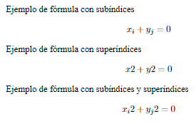
> Se pueden escribir subíndices de subíndices o superíndices de superíndices anidando los comandos.

### 8.3. Fracciones
Para escribir fracciones simples en línea se puede usar el operador aritmético ***/*** (por ejemplo 3/4), pero para fracciones más complejas o fracciones en modo display, conviene utilizar el comando ***\frac{num}{den}***, donde **num** es el numerador y **den** el denominador.

A su vez, se pueden escribir más fracciones en el numerador o el denominador, anidando este comando.

##### Ejemplo
~~~~ latex
% CUERPO
\begin{document}
Ejemplo de fracción en línea $\frac{x+2}{x^2-2x+1}$.

Ejemplo de fracción en modo desplegado
$$
\frac{\frac{x}{2}+\frac{2}{3}}{x^2-2x+1}
$$
\end{document}
~~~~
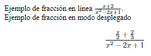

### 8.4. Sumatorios, productorios e integrales
Para escribir sumatorios se utiliza el comando ***\sum_{sub}^{sup}***, donde **sub** es el subíndice que indica el inicio de la suma y **sup** es el superíndice que indica el final de la suma. Si se quieren omitir los índices de inicio y final de la suma, basta con el comando ***\sum***.

De manera análoga, para escribir productorios se utiliza el comando ***\prod_{sub}^{sup}***, donde **sub** es el subíndice que indica el inicio del producto y **sup** es el superíndice que indica el final del producto. Si se quieren omitir los índices de inicio y final del producto, basta con el comando ***\prod***.

##### Ejemplo
~~~~ latex
% CUERPO
\begin{document}
Ejemplo de sumatorio
$$
\sum_{i=1}^{\infty} x^i
$$

Ejemplo de productorio
$$
\prod_{i=1}^n i
$$
\end{document}
~~~~
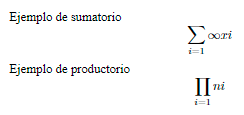

Del mismo modo, para escribir integrales definidas se utiliza el comando ***\int_{sub}^{sup}***, donde **sub** es el subíndice que indica el inicio de la integral y **sup** es el superíndice que indica el final de la integral. Para integrales indefinidas, basta con el comando ***\int***.

##### Ejemplo
~~~~ latex
% CUERPO
\begin{document}
Ejemplo de integral definida
$$
\int_a^b f(x)\,dx
$$

Ejemplo de integral indefinida
$$
\int f(x)\,dx
$$
\end{document}
~~~~

### 8.5. Sombreros
Es posible poner símbolos encima de otros símbolos, más conocidos como sombreros. Los siguientes comandos sirven para poner distintos tipos de sombreros:
- ***\bar{...}*** - Linea horizontal para un carácter.
- ***\overline{...}*** - Línea horizontal para varios caracteres.
- ***\hat*** - Ángulo para un carácter.
- ***\widehat*** - Ángulo para varios caracteres.
- ***\vec{...}*** - Flecha para un carácter.
- ***\overrightarrow{...}*** - Flecha para varios caracteres.

##### Ejemplo
~~~~ latex
% CUERPO
\begin{document}
Ejemplos de sombreros: $\overline{xy}$, $\hat{a}$, $\widehat{abc}$, $\vec{u}$.
\end{document}
~~~~
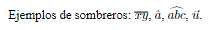

### 8.6. Matrices
Las matrices se crean de manera similar a como se crean las [tablas](#6-tablas), pero utilizando el entorno **array** en lugar del entorno **tabular**. Para encerrar la matriz entre paréntesis se pone el comando ***\left(*** antes del entorno y el comando ***\right)*** después.

##### Ejemplo
~~~~ latex
% CUERPO
\begin{document}
Ejemplo de matriz
$$
\left(
\begin{array}{rrr}
1 & 2 & 3 \\
x & y & z \\
\end{array}
\right)
$$
\end{document}
~~~~
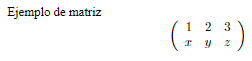

El paquete **amsmath** incorpora varios entornos más específicos para matrices donde no es necesario especificar el número de columnas, y tampoco los delimitadores:
- **matrix** - Matriz sin delimitadores (equivalente al entorno **array**)
- **pmatrix** - Matriz encerrada entre paréntesis.
- **vmatrix** - Matriz encerrada entre barras verticales (por ejemplo para determinates).
- **Vmatrix** - Matriz encerrada ente dobles barras verticales.
- **bmatrix** - Matriz encerrada entre corchetes.
- **Bmatrix** - Matriz encerrada entre llaves.

##### Ejemplo
~~~~ latex
% PREÁMBULO
\usepackage{amsmath}

% CUERPO
\begin{document}
Ejemplo de determinante
$$
\begin{vmatrix}
1 & x & \alpha \\
2 & y & \beta \\
3 & z &\gamma
\end{vmatrix}
$$
\end{document}
~~~~
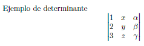

### 8.7. Teoremas
Para crear denificiones, teoremas, proposiciones, corolarios y otros tipos de enunciados de sebe cargar el paquete **amsthm** y definir los tipos de enunciados en el preámbulo con el comando ***\newtheorem{entorno}{texo}***, donde **entorno** es el nombre del entorno y **texto** el texto que aparerá en el documento final como encabezado del enunciado.

Estos entornos admiten como argumento opcional un texto que se utiliza para dar nombre al enunciado.

Los enunciados definidos con este comando aparecen por defecto numerados para poder referenciarlos en otras partes del documento, pero se pueden definir entornos no numerados con la variante del comando anterior ***\newtheorem*{entorno}{texo}***.

Para demostraciones se puede utilizar el entorno **proof**.

##### Ejemplo
~~~~ latex
% PREÁMBULO
\usepackage{amsmath}
\DeclareMathOperator{\sen}{sen}
\usepackage{amsthm}
\newtheorem{midef}{Definición}
\newtheorem{teo}{Teorema}

% CUERPO
\begin{document}
\begin{midef}
Dado un triángulo rectángulo de catetos $a$, $b$ e hipotenusa $c$, se define
el seno del ángulo $\alpha$ opuesto al cateto $b$ como
$$
\sen{\alpha}= \frac{b}{c}.
$$
\end{midef}

\begin{teo}
Para cualquier ángulo $\alpha$ se cumple
$\sen(\alpha)^2 + \cos(\alpha)^2 = 1$.
\end{teo}

\begin{proof}
Es una consecuencia directa del teorema de Pitágoras.
\end{proof}
\end{document}
~~~~

> 💡 **CONSEJO:** Se recomienda cargar los paquetes **amsmath**, **amssymb** y **amsthm** para documentos extensos o con muchas fórmulas matemáticas.

[^2]: Para un listado más exhaustivo de los símbolos matemáticos de *LaTeX*, puede consultarse el documento *[The Great, Big List of LaTeX Symbols](Fotos/Manual_LaTeX/LaTeX_symbols.pdf)*.

## 9. ENTORNOS FLOTANTES
---
Hay determinados contenidos, como por ejemplo las tablas o las imágenes que son bloques indivisibles, de manera que cuando no hay espacio suficiente en la página para encajarlos, pasan a colocarse en la siguiente página, dejando en la página anterior un espacio vertical vacío poco estético.

La solución consiste en incluir estos contenidos en un entorno flotante, que se ubicará automáticamente sin dejar espacios vacíos. Como estos contenidos pueden aparecer lejos de su posición en el código fuente, para que no estén descontextualizados suelen llevar asociada una leyenda.

Existen dos entornos flotantes, para figuras y tablas.

### 9.1. Entorno flotante para figuras
El entorno flotante para figuras es figure tiene el siguiente esqueleto.
~~~~ latex
\begin{figure}[posición]
    Código de las imágenes
\label{etiqueta}
\caption{leyenda}
\end{figure}
~~~~

El argumento opcional indica la preferencia de ubicación de la figura en la página (**h** en el lugar en el que aparece en el código fuente, **t** arriba, **b** abajo). *LaTeX* intentará ubicar la figura en esa posición salvo que no sea posible.

Las figuras flotantes se numeran automáticamente y el comando ***\label{...}*** asigna una etiqueta al entorno flotante para poder referenciarlo desde otras partes del documento. Por su parte, el comando ***\caption{...}*** crea la leyenda de la figura.
~~~~ latex
% PREÁMBULO
\usepackage{graphicx}

% CUERPO
\begin{document}
Ejemplo de imagen flotante. Como se puede apreciar la imagen aparece al principio de la página aunque va después de este párrafo en el código fuente.

\begin{figure}[t]
\begin{center}
\includegraphics{img/logo-aprendeconalf.png}
\end{center}
\label{img-1}
\caption{Logotipo del sitio web AprendeconAlf.}
\end{figure}
\end{document}
~~~~
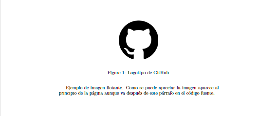
> Para incluir el listado de figuras de un documento en cualquier parte se utiliza el comando ***\listoffigures***.

### 9.2. Entorno flotante para tablas
El entorno flotante para tablas es table y su esqueleto es muy parecido al del entorno para figuras.
~~~~ latex
\begin{table}[posición]
    Código de la tabla
\label{etiqueta}
\caption{leyenda}
\end{table}
~~~~

Las tablas, al igual que las figuras, se enumeran automáticamente y pueden referenciarse después asignándoles una etiqueta con el comando ***\label{...}***.
~~~~ latex
% CUERPO
\begin{document}
Ejemplo de tabla flotante. Como se puede apreciar la tabla aparece al principio de la página aunque va después de este párrafo en el código fuente.

\begin{table}[t]
\begin{center}
\begin{tabular}{|l|c|r|}
\hline
Nombre & Ciudad & Edad \\
\hline
\hline
María & Valencia & 22 \\
\hline
Juan & Madrid & 50 \\
\hline
Carmen & Barcelona & 35 \\
\hline
\end{tabular}
\end{center}
\label{img-1}
\caption{Tabla de clientes de una empresa.}
\end{table}
\end{document}
~~~~
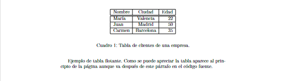
> Para incluir el listado de figuras de un documento en cualquier parte se utiliza el comando ***\listoftables***.

## 10. REFERENCIAS CRUZADAS Y NOTAS A PIE
---
Otro de los puntos fuertes de *LaTeX* es la gestión de las referencias cruzadas, es decir, referencias a otras partes del documento, así como las notas a pie de página.

### 10.1. Referencias cruzadas
Como se ha visto, muchos elementos de un documento están enumerados: capítulos, secciones, figuras, tablas, ecuaciones, teoremas, páginas, etc. Para poder referenciarlos, cada elemento debe tener asignada una etiqueta única. Para asignar una etiqueta a cualquier elemento numerado se utiliza el comando ***\label{etiqueta}***. Este comando debe ubicarse justo antes o después del elemento que quiere etiquetar.

Posteriormente, para hacer una referencia al elemento en otra parte del documento se utiliza el comando ***\ref{etiqueta}***.

##### Ejemplo
~~~~ latex
% PREÁMBULO
\usepackage{amsmath}
\DeclareMathOperator{\sen}{sen}
\usepackage{amsthm}
\newtheorem{teo}{Teorema}

% CUERPO
\begin{document}
\begin{teo}\label{teo-trigo}
Para cualquier ángulo
$\alpha$ se cumple
\begin{equation}\label{eq-trigo}
\sen(\alpha)^2 + \cos(\alpha)^2 = 1.
\end{equation}
\end{teo}

Ejemplo de referencia cruzada. La ecuación \ref{eq-trigo} del teorema \ref{teo-trigo} es una ecuación básica en trigonometría.
\end{document}
~~~~

### 10.2. Notas a pie de página
Para insertar una nota a pié de página se utiliza el comando ***\footnote{...}***.

##### Ejemplo
~~~~ latex
% CUERPO
\begin{document}
El logotipo de latex es $\LaTeX$.\footnote{Fue creado por Leslie Lamport.}
\end{document}
~~~~

## 11. CITAS Y REFERENCIAS BIBLIOGRÁFICAS
---
Al igual que con las referencias cruzadas, *LaTeX* hace un maravilloso trabajo con las citas de referencias bibliográficas. Para ello se apoya en otro programa de gestión de referencias bibliográficas llamado *BibTeX*, que viene incluido en la distribución estándar de *LaTeX*. *[BibTeX](https://www.bibtex.org/)* permite crear una base de datos de distintos tipos de documentos que después se pueden citar en nuestro documento y después listar al final del documento las referencias bibliográficas citadas con diferentes formatos.

También existe otro gestor de referencias bibliográficas llamado biber que soporta la codificación de caracteres unicode, y por tanto es más apropiado si vamos a compilar nuestro documento con *xelatex*.

Para incluir referencias bibliográficas en un documento primero hay que crear una base de datos con las fuentes bibliográficas que vayamos a usar en un documento. Esa base de datos se crea en un fichero de texto independiente con el formato que requiere *BibTex* con extensión *.bib*.

La sintaxis para crear una nueva entrada bibliográfica en la base de datos es un poco compleja al principio, pero afortunadamente existen bastantes aplicaciones de gestión bibliográfica, como *[Zotero](https://www.zotero.org/)*, *[Mendely](https://www.mendeley.com/)*, *[EndNote](https://endnote.com/)*, *[RefWorks](https://refworks.proquest.com/researcher/)* o *[BibSonomy](https://www.bibsonomy.org/)* que incluyen la posibilidad de exportar la bibliografía en ese formato.

##### Ejemplo
El siguiente fichero contiene una base de datos bibliográfica con dos entradas, un libro y un artículo de una revista.
~~~~ latex
% Fichero bibliografia.bib
@book{lamport_latex_1994,
edition = {2nd},
title = {{LaTeX}: {A} {Document} {Preparation} {System}, 2nd {Edition}},
isbn = {978-0-201-52983-8},
publisher = {Addison-Wesley Professional.},
author = {Lamport, Leslie},
month = jun,
year = {1994}
}
@article{borbon_latex_2022,
    title = {{LaTeX}: {Primeros} pasos},
    journal = {Revista digital Matemática, Educación e Internet.},
    author = {{Borbón, Alexánder} and {Mora, Walter}},
    year = {2022},
    pages = {2--7},
}
~~~~

Obsérvese que cada entrada bibliográfica empieza por el tipo de documento (*book*, *article*, etc.) y está descrita por varios campos: **title** (título), **author** (autor), **journal** (revista), **year** (año), etc. El primer campo es una clave que identifica al documento de manera única y que se utilizará posteriormente para citarlo.

Una vez creada la base de datos, para citar cualquier referencia contenida en ella, hay que cargar en el preámbulo el paquete **biblatex** e indicar la ubicación de la base de datos con el comando ***\addbibresource{bibliografia.bib}***, donde **bibliografia.bib** es el nombre del fichero con la base de datos bibliográfica (incluida la ruta), y luego escribir el comando ***\cite{clave}***, donde **clave** es la clave de la entrada bibliográfica en la base de datos, en el lugar donde se quiera hacer la referencia.

Finalmente para listar las referencias bibliográficas citadas en el documento basta con insertar el comando ***\printbibliography***.

##### Ejemplo
~~~~ latex
% PREÁMBULO
\usepackage{biblatex}
\addbibresource{bibliografia.bib}

% CUERPO
\begin{document}
El principal libro sobre latex es \cite{lamport_latex_1994}, aunque también
es muy interesante el artículo \cite{borbon_latex_2022}

\printbibliography
\end{document}
~~~~

Existen diferentes estilos para las citaciones y para el listado con las referencias bibliográficas que se pueden indicar en la carga del paquete **biblatex** con el parámetro opcional **style**. Por ejemplo si en lugar de números en las citaciones queremos que aparezca las iniciales del autor y el año, hay que seleccionar el estilo **style=alphabetic**. En el siguiente enlace existe un listado exahustivo de los diferentes [estilos de citación](https://www.overleaf.com/learn/latex/Biblatex_citation_styles).

Por último si en lugar de **bibtex** se quiere usar biber para gestionar las referencias bibliográficas, hay que indicarlo también ebn la carga del paquete biblatex mediante el parámetro opcional **backend=biber**.

##### Ejemplo
~~~~ latex
% PREÁMBULO
\usepackage[
backend=biber, style=alphabetic]{biblatex}
\addbibresource{bibliografia.bib}

% CUERPO
\begin{document}
El principal libro sobre latex es \cite{lamport_latex_1994}, aunque también
es muy interesante el artículo \cite{borbon_latex_2022}

\printbibliography
\end{document}
~~~~
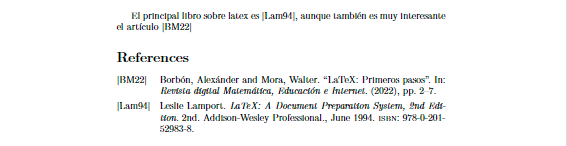

## 12. DISEÑO DE PÁGINA
---
Existen distintos parámetros que determinan el aspecto final de una página con texto. En este capítulo veremos como modificar las dimensiones de la página, los márgenes, y cómo introducir encabezados y pies.

### 12.1. Dimensiones y márgenes
Aunque es posible definir el tamaño de la página como un argumento del comando que define la clase del documento ***\documentclass***, si queremos tener mayor control sobre las dimensiones del documento, así como de los márgenes, conviene utilizar el paquete **geometry**.

El paquete geometry permite definir las dimensiones de la página mediante un argumento opcional con distintos tamaños de página predefinidos (**a4paper**, **a5paper**, **b1paper**, **letterpaper**, etc.), pero también es posible definir nuestras propias dimensiones con los siguientes argumentos:
- **paperheight=x** - Establece la longitud vertical de la página en **x** (es necesario indicar las unidades *pt*, *mm* o *cm*)
- **paperwidth=x** - Establece la longitud horizontal de la página en **x**.

Por defecto la orientación del documento es vertical, pero puede ponerse en formato horizontal o apaisado con el argumento **landscape**.

##### Ejemplo
~~~~ latex
% PREÁMBULO
\usepackage[a5paper, landscape]{geometry}
\usepackage{blindtext}

% CUERPO
\begin{document}
\section{Introducción}
Esta es una página de tamaño A5 apaisada.
\subsection{Texto de relleno}
\blindtext[2]
\end{document}
~~~~

También permite definir los márgenes del documento mediante los siguientes argumentos:
- **margin=x** - Establece los cuatro márgenes (izquierdo, derecho, superior e inferior) con tamaño **x** (es necesario indicar las unidades *pt*, *mm* o *cm*).
- **left=x** - Establece el margen izquierdo con tamaño **x**.
- **right=x** - Establece el margen derecho con tamaño **x**.
- **top=x** - Establece el margen superior con tamaño **x**.
- **bottom=x** - Establece el margen inferior con tamaño **x**.

##### Ejemplo
~~~~ latex
% PREÁMBULO
\usepackage[a4paper, left=2.5cm, right=3.5cm, top=45mm, bottom=20mm]{geometry}
\usepackage{blindtext}

% CUERPO
\begin{document}
\section{Introducción}
Este es una página con márgenes personalizados.
\subsection{Texto de relleno}
\blindtext[7]
\end{document}
~~~~
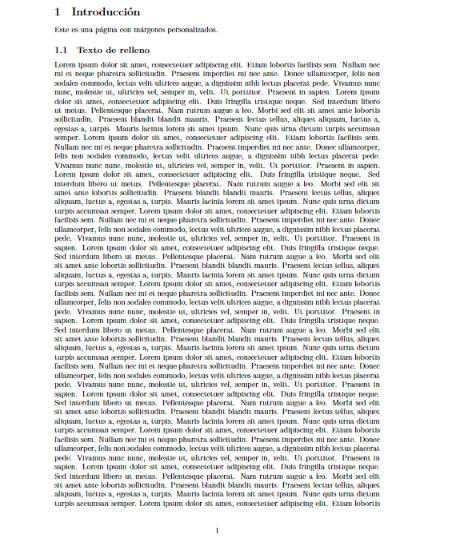

### 12.2. Encabezados y pies de página
*LaTeX* incluye encabezados y pies de página automáticos dependiendo del tipo de documento. Para las clases **article** y **report** no hay encabezado y el pie es el número de página, mientras que para la clase book el encabezado incluye la página y la sección a la que corresponde la página. No obstante, el usuario puede definir sus propios encabezados y pies mediante el paquete **fancyhdr**.

Una vez cargado este paquete y antes de definir el texto del encabezado y del pie, hay que cambiar el estilo de página (**plain** por defecto) a **fancy**, y para ello se utiliza el comando ***\pagestyle{fancy}*** que indica al compilador que se van a usar un encabezado y pie personalizados.

A continuación hay definir el texto del encabezado y del pie. El paquete **fancyhdr** divide tanto el encabezado como el pie de página en tres areas (izquierda, centro y derecha) e incorpora comandos para escribir en cada una de ellas. El texto del área de la izquierda siempre se justifica a la izquierda, el del área del centro se justifica centrado y el del área derecha justificado a la derecha. Por otro lado, para documentos a doble cara, se distingue también entre encabezados y pies de páginas pares e impares.

Para definir el encabezado y el pie de página se utilizan los comandos:
- ***\fancyhead[opcion]{texo}*** - Añade el texto al encabezado de página en el area que se indique en el argumento opcional opcion, que puede ser L (área de la izquierda), C (área del centro) o R (área de la derecha), aunque para documentos a doble cara también se puede especificar el encabezado para páginas pares añadiendo una **E** o impares añadiendo una **O**.
- ***\fancyfoot[opcion]{texo}*** - Añade el texto al pie en el area que se indique en el argumento opcional opcion.
> ⚠️ **ADVERTENCIA:** El paquete **fancyhdr** no elimina los encabezados por defecto de cada tipo de documento, por lo que si se van a definir encabezados o pies personalizados, conviene utilizar los comandos ***\fancyhead{}*** y ***\fancyfoot{}*** para eliminar el encabezado y pie por defecto antes de definir los propios.

##### Ejemplo
~~~~ latex
% PREÁMBULO
\usepackage{blindtext}
\usepackage{fancyhdr}
\pagestyle{fancy}
\fancyhead{} % Borra el encabezado por defecto
\fancyhead[RO,LE]{\textbf{Mi encabezado}}
\fancyhead[C]{Alfredo Sánchez}
\fancyfoot{} % Borra el pie por defecto
\fancyfoot[LE,RO]{\thepage}
\fancyfoot[LO,RE]{\texttt{http://aprendeconalf.es}}

% CUERPO
\begin{document}
\section{Introducción}
Este es una página con encabezado y pie personalizado.

\subsection{Texto de relleno}

\blindtext[9]
\end{document}
~~~~
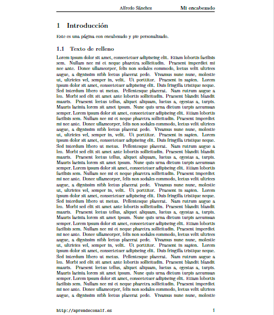 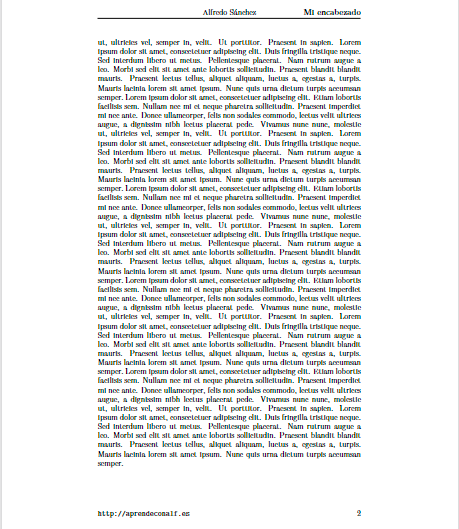
